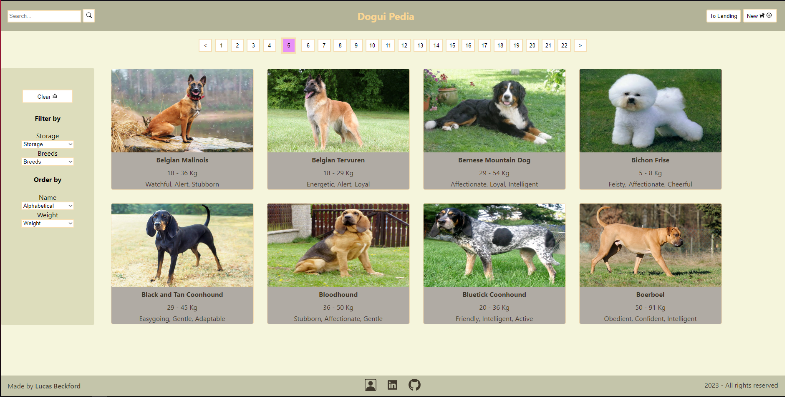

<!--  -->

# Individual Project - Henry Dogs
<!-- 
 -->

## Objetivos del Proyecto

- Construir una App utlizando React, Redux, Node y Sequelize.
- Afirmar y conectar los conceptos aprendidos en la carrera.
- Aprender mejores prácticas.
- Aprender y practicar el workflow de GIT.
- Usar y practicar testing.

## Estructura

El Proyecto cuenta con dos carpetas: `api` y `client`. En estas carpetas estará el código del back-end y el front-end respectivamente.

El contenido de `client` fue creado usando: Create React App.

## Enunciado

La idea general es crear una aplicación en la cual se puedan ver distintas razas de perro junto con información relevante de las mismas utilizando la api externa [the dog api](https://thedogapi.com/) y a partir de ella poder, entre otras cosas:

- Buscar perros
- Filtrarlos / Ordenarlos
- Agregar nuevos perros

### Endpoints/Flags utilizados

- GET <https://api.thedogapi.com/v1/breeds>

### Requerimientos mínimos

A continuación se detallaran los requerimientos mínimos del proyecto.

__IMPORTANTE__: No se utilizará ningun tipo de librería externa para aplicar estilos a la aplicación, solo CSS puro. Esto a modo de práctica

#### Tecnologías a utilizar

- [ ] React
- [ ] Redux
- [ ] Express
- [ ] Sequelize - Postgres

## Frontend

Se debe desarrollar una aplicación de React/Redux que contenga las siguientes pantallas/rutas.

__Pagina inicial__: deben armar una landing page con

- [ ] Alguna imagen de fondo representativa al proyecto
- [ ] Botón para ingresar al home (`Ruta principal`)

__Ruta principal__: debe contener

- [ ] Input de búsqueda para encontrar razas de perros por nombre
- [ ] Área donde se verá el listado de razas de perros. Deberá mostrar su:
  - Imagen
  - Nombre
  - Temperamento
  - Peso
- [ ] Botones/Opciones para filtrar por:
  - Temperamento
  - Raza existente (es decir las que vienen de la API) o agregada por nosotros (creadas mediante el form)
- [ ] Botones/Opciones para ordenar tanto ascendentemente como descendentemente las razas de perro por:
  - Orden alfabético
  - Peso
- [ ] Paginado para ir buscando y mostrando las siguientes razas, mostrando 8 razas por página.

__Ruta de detalle de raza de perro__: debe contener

- [ ] Los campos mostrados en la ruta principal para cada raza (imagen, nombre y temperamento)
- [ ] Altura
- [ ] Peso
- [ ] Años de vida

__Ruta de creación de raza de perro__: debe contener

- [ ] Un formulario __controlado con JavaScript__ con los siguientes campos:
  - Nombre
  - Altura (Diferenciar entre altura mínima y máxima)
  - Peso (Diferenciar entre peso mínimo y máximo)
  - Años de vida
- [ ] Posibilidad de seleccionar/agregar uno o más temperamentos
- [ ] Botón/Opción para crear una nueva raza de perro

> El formulario de creación estará validado con JavaScript y no sólo con validaciones HTML. Por ejemplo: Que el nombre de la raza no pueda contener números o símbolos, que el peso/altura mínimo no pueda ser mayor al máximo y viceversa, etc.

## Base de datos

El modelo de la base de datos deberá tener las siguientes entidades (Aquellas propiedades marcadas con asterísco deben ser obligatorias):

- [ ] Raza con las siguientes propiedades:
  - ID *
  - Nombre *
  - Altura *
  - Peso *
  - Años de vida
- [ ] Temperamento con las siguientes propiedades:
  - ID
  - Nombre

La relación entre ambas entidades debe ser de muchos a muchos ya que una raza de perro puede tener varios "temperamentos" en simultaneo y, a su vez, un "temperamento" puede corresponder a múltiples razas de perro distintas. Por ejemplo la raza `pug` es docil, inteligente y sociable (entre otras). Pero a su vez existen otras razas de perro que también son sociables o inteligentes.

__IMPORTANTE__: Diferenciar el id de las razas creadas y de las existentes, utilizando en el modelo UUID.

## Backend

Se debe desarrollar un servidor en Node/Express con las siguientes rutas:

__IMPORTANTE__: Los ordenamientos y flitrados se harán en el front, esto a modo de práctica.

- [ ] __GET /dogs__:
  - Obtener un listado de las razas de perro
  - Debe devolver solo los datos necesarios para la ruta principal
- [ ] __GET /dogs?name="..."__:
  - Obtener un listado de las razas de perro que contengan la palabra ingresada como query parameter
  - Si no existe ninguna raza de perro mostrar un mensaje adecuado
- [ ] __GET /dogs/{idRaza}__:
  - Obtener el detalle de una raza de perro en particular
  - Debe traer solo los datos pedidos en la ruta de detalle de raza de perro
  - Incluir los temperamentos asociados
- [ ] __POST /dogs__:
  - Recibe los datos recolectados desde el formulario controlado de la ruta de creación de raza de perro por body
  - Crea una raza de perro en la base de datos relacionada con sus temperamentos
- [ ] __GET /temperaments__:
  - Obtener todos los temperamentos posibles
  - En una primera instancia deberán obtenerlos desde la API externa y guardarlos en su propia base de datos y luego ya utilizarlos desde allí

## Testing

- [ ] Tener, como mínimo, un componente del frontend con sus tests respectivos
- [ ] Tener, como mínimo, una ruta del backend con sus tests respectivos
- [ ] Tener, como mínimo, un modelo de la base de datos con sus tests respectivos
